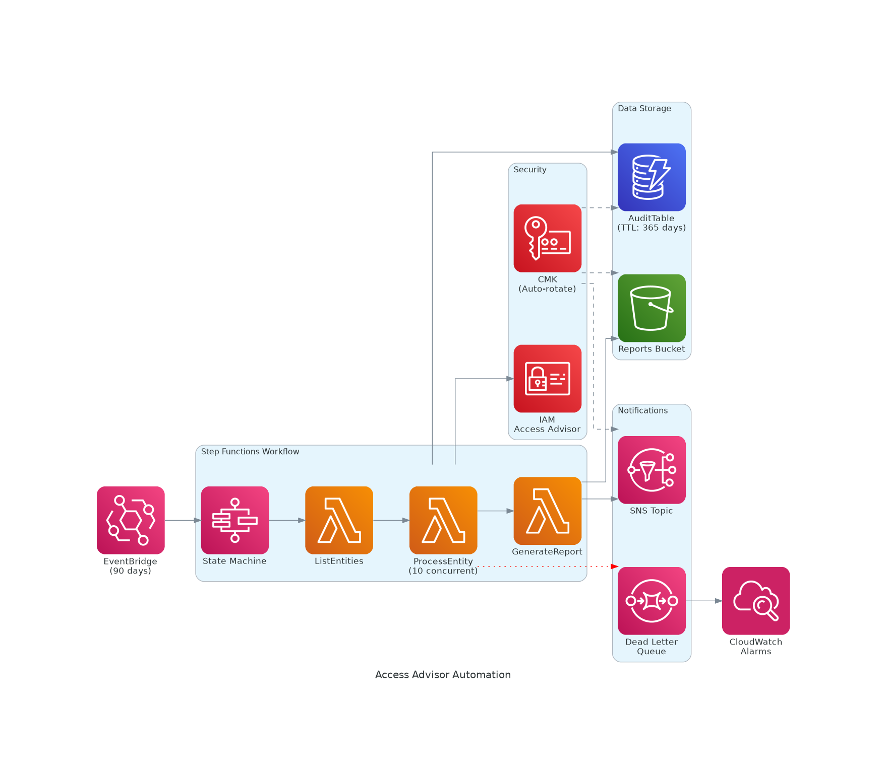
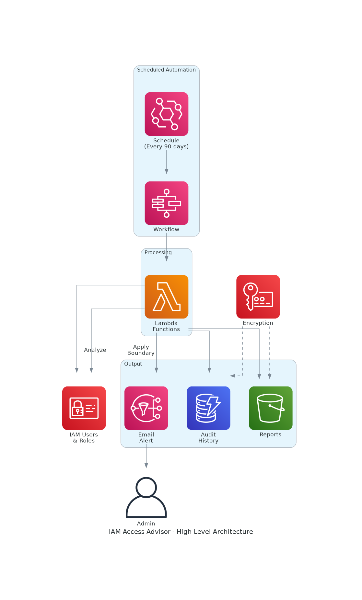

# AWS IAM Access Advisor Automation

[](LICENSE)
[](https://aws.amazon.com/serverless/sam/)
[](https://www.python.org/)

Automatically audit IAM permissions and enforce least privilege using AWS Access Advisor data.

## Architecture



## High-Level Overview



## Features

- **Automated Audit** - Analyzes all IAM users and roles using Access Advisor API
- **Permissions Boundary** - Automatically creates and applies boundaries based on actual usage
- **Scheduled Execution** - Runs every 90 days via EventBridge
- **Audit History** - Stores results in DynamoDB with 365-day TTL
- **Reports** - Generates JSON reports in S3
- **Notifications** - Email alerts via SNS when audit completes
- **Security** - KMS encryption for all data at rest

## Components

| Service | Purpose |
|---------|---------|
| EventBridge | Scheduled trigger (90 days) |
| Step Functions | Workflow orchestration |
| Lambda | ListEntities, ProcessEntity, GenerateReport |
| DynamoDB | Audit history storage |
| S3 | Reports storage |
| SNS | Email notifications |
| KMS | Encryption at rest |
| CloudWatch | Alarms & monitoring |

## Quick Start

### Prerequisites

- AWS CLI configured
- [SAM CLI](https://docs.aws.amazon.com/serverless-application-model/latest/developerguide/install-sam-cli.html) installed
- Python 3.11+

### Deploy

```bash
# Clone repository
git clone https://github.com/vanhoangkha/aws-iam-accessadvisor-permissionboundary.git
cd aws-iam-accessadvisor-permissionboundary

# Build and deploy
sam build
sam deploy --guided
```

### Parameters

| Parameter | Default | Description |
|-----------|---------|-------------|
| `Environment` | prod | Environment name |
| `DaysExpire` | 180 | Days before unused permissions are restricted |
| `Enforce` | yes | Apply permissions boundaries (yes/no) |
| `NotificationEmail` | - | Email for notifications |

## How It Works

1. **EventBridge** triggers Step Functions workflow every 90 days
2. **ListEntities Lambda** retrieves all IAM users and roles
3. **ProcessEntity Lambda** (10 concurrent):
   - Calls IAM Access Advisor API
   - Analyzes service usage within expiration period
   - Tags entities with coverage metrics
   - Creates/updates permissions boundary policies
   - Stores audit data in DynamoDB
4. **GenerateReport Lambda** creates summary report in S3
5. **SNS** sends email notification with results

## Exclusions

The following entities are excluded from permissions boundary enforcement:

- `AccessAdvisor-*` (solution's own roles)
- `AWSServiceRole*` (AWS service-linked roles)
- `admin` (admin users)
- `OrganizationAccountAccess*`

## Output Examples

### DynamoDB Record

```json
{
  "pk": "role#my-role",
  "sk": "audit#2026-02-02",
  "coverage": 75,
  "total": 100,
  "used": 75,
  "services_used": ["s3", "dynamodb", "lambda"]
}
```

### S3 Report

```json
{
  "date": "2026-02-02",
  "total_entities": 85,
  "avg_coverage": 48,
  "details": [
    {"name": "my-role", "type": "role", "coverage": 75, "services": 3}
  ]
}
```

## Security

- All data encrypted with KMS CMK (auto-rotation enabled)
- Least privilege IAM roles for each Lambda function
- S3 bucket policy enforces SSL and KMS encryption
- DLQ for failed processing with CloudWatch alarms
- Point-in-time recovery enabled for DynamoDB

## Cost Estimation (2026 Pricing)

> **Region:** Asia Pacific (Singapore) - ap-southeast-1  
> **Last Updated:** February 2026

### Pricing Reference (Singapore Region)

| Service | Unit | Price (USD) |
|---------|------|-------------|
| Lambda Requests | per 1M requests | $0.20 |
| Lambda Duration (x86) | per GB-second | $0.0000166667 |
| Step Functions | per 1,000 state transitions | $0.025 |
| DynamoDB Write | per 1M write request units | $0.625 |
| DynamoDB Read | per 1M read request units | $0.125 |
| DynamoDB Storage | per GB-month | $0.285 |
| S3 Standard | per GB-month | $0.025 |
| S3 PUT requests | per 1,000 requests | $0.005 |
| KMS CMK | per key per month | $1.00 |
| KMS Requests | per 10,000 requests | $0.03 |
| CloudWatch Logs | per GB ingested | $0.57 |
| CloudWatch Alarms | per alarm per month | $0.10 |
| SNS | per 1M requests | $0.50 |

### Monthly Cost Calculation (100 IAM Entities)

**Assumptions:**
- 100 IAM entities (users + roles)
- Runs every 90 days (~0.33 executions/month)
- Average 300 seconds per ProcessEntity Lambda

| Service | Calculation | Monthly Cost |
|---------|-------------|--------------|
| **Lambda** | | |
| - Requests | 103 requests × $0.20/1M | $0.00 |
| - ListEntities | 60s × 0.25GB × $0.0000166667 × 0.33 | $0.00 |
| - ProcessEntity | 100 × 300s × 0.5GB × $0.0000166667 × 0.33 | $0.08 |
| - GenerateReport | 60s × 0.25GB × $0.0000166667 × 0.33 | $0.00 |
| **Step Functions** | 505 transitions × $0.025/1000 × 0.33 | $0.00 |
| **DynamoDB** | | |
| - Writes | 100 WRU × $0.625/1M × 0.33 | $0.00 |
| - Storage | 0.01GB × $0.285 | $0.00 |
| **S3** | | |
| - Storage | 0.001GB × $0.025 | $0.00 |
| - PUT requests | 2 requests × $0.005/1000 | $0.00 |
| **KMS** | 1 key × $1.00 | $1.00 |
| **CloudWatch** | | |
| - Logs | 0.05GB × $0.57 | $0.03 |
| - Alarms (2) | 2 × $0.10 | $0.20 |
| **SNS** | 1 notification × $0.50/1M | $0.00 |
| **EventBridge** | Scheduled rules | Free |
| **Total** | | **$1.31** |

### Cost by Scale

| Scale | Entities | Lambda Duration | DynamoDB Writes | Monthly Cost | Annual Cost |
|-------|----------|-----------------|-----------------|--------------|-------------|
| Startup | 50 | 2,500 GB-s | 50 WRU | $1.27 | $15.24 |
| SMB | 100 | 5,000 GB-s | 100 WRU | $1.31 | $15.72 |
| Medium | 500 | 25,000 GB-s | 500 WRU | $1.52 | $18.24 |
| Large | 1,000 | 50,000 GB-s | 1,000 WRU | $1.79 | $21.48 |
| Enterprise | 5,000 | 250,000 GB-s | 5,000 WRU | $3.60 | $43.20 |

### AWS Free Tier Coverage

| Service | Free Tier (Monthly) | Solution Usage | Status |
|---------|---------------------|----------------|--------|
| Lambda Requests | 1,000,000 | ~103 | ✅ Covered |
| Lambda Compute | 400,000 GB-s | ~1,650 GB-s | ✅ Covered |
| DynamoDB Storage | 25 GB | <0.1 GB | ✅ Covered |
| DynamoDB WRU | 25 WCU | ~33 WRU | ✅ Covered |
| S3 Storage | 5 GB | <0.01 GB | ✅ Covered |
| Step Functions | 4,000 transitions | ~167 | ✅ Covered |
| CloudWatch Alarms | 10 alarms | 2 | ✅ Covered |
| SNS | 1,000,000 requests | ~0.33 | ✅ Covered |

**With Free Tier: ~$1.00/month (KMS key only)**

### Cost Optimization Applied

| Optimization | Implementation | Savings |
|--------------|----------------|---------|
| On-Demand DynamoDB | PAY_PER_REQUEST billing | ~90% vs Provisioned |
| Reserved Concurrency | Max 10 concurrent ProcessEntity | Prevents spike |
| S3 Intelligent-Tiering | Lifecycle rule after 30 days | ~40% storage |
| DynamoDB TTL | Auto-delete after 365 days | Reduces storage |
| 90-day Schedule | EventBridge rate(90 days) | ~75% vs weekly |
| Lambda Memory Tuning | 256MB-512MB per function | Optimal cost/performance |

### ROI Analysis

| Approach | Time/Execution | Cost/Year | Notes |
|----------|----------------|-----------|-------|
| Manual Audit | 33 hours | ~$6,600 | 4 audits × $50/hr × 33hrs |
| This Solution | 5 minutes | ~$16 | Fully automated |
| **Savings** | **99.8%** | **$6,584** | |

### Cost Monitoring

Monitor costs using AWS Cost Explorer with these tags:
- `Project: AccessAdvisor`
- `Environment: prod`

> 📊 Use [AWS Pricing Calculator](https://calculator.aws/#/createCalculator) for custom estimates.  
> 📈 Prices may vary. Check [AWS Pricing](https://aws.amazon.com/pricing/) for latest rates.

## Project Structure

```
.
├── template.yaml              # SAM template (production-ready)
├── statemachine.asl.json      # Step Functions definition
├── cf.yml                     # Simple CloudFormation template
├── accessadvisor_automation.py # Standalone Python script
├── architecture.png           # Detailed architecture diagram
└── architecture-high-level.png # High-level architecture diagram
```

## Contributing

Contributions are welcome! Please read [CONTRIBUTING.md](CONTRIBUTING.md) for details.

## License

This project is licensed under the Apache License 2.0 - see the [LICENSE](LICENSE) file for details.

## Acknowledgments

- Based on [aws-samples/aws-iam-accessadvisor-permissionboundary](https://github.com/aws-samples/aws-iam-accessadvisor-permissionboundary)
- Enhanced with Step Functions, DynamoDB, and security hardening
