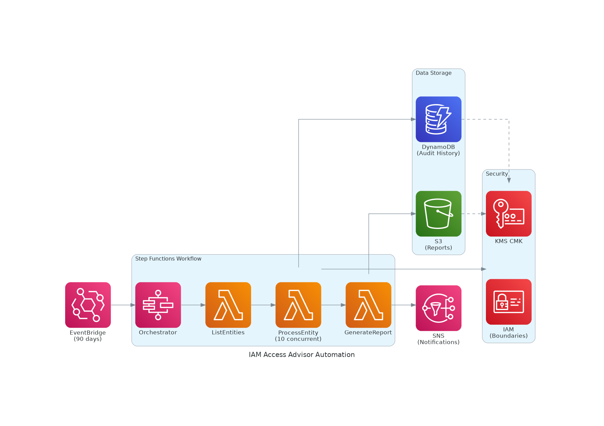
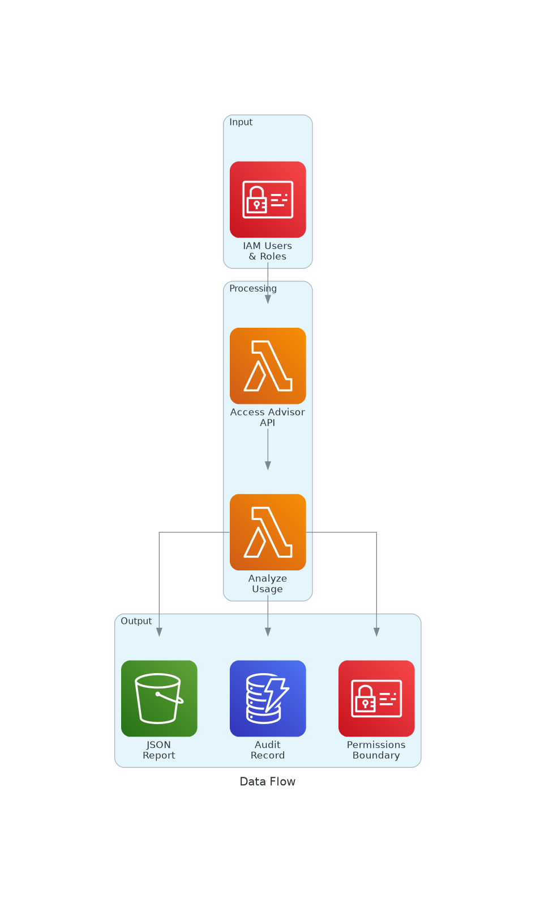
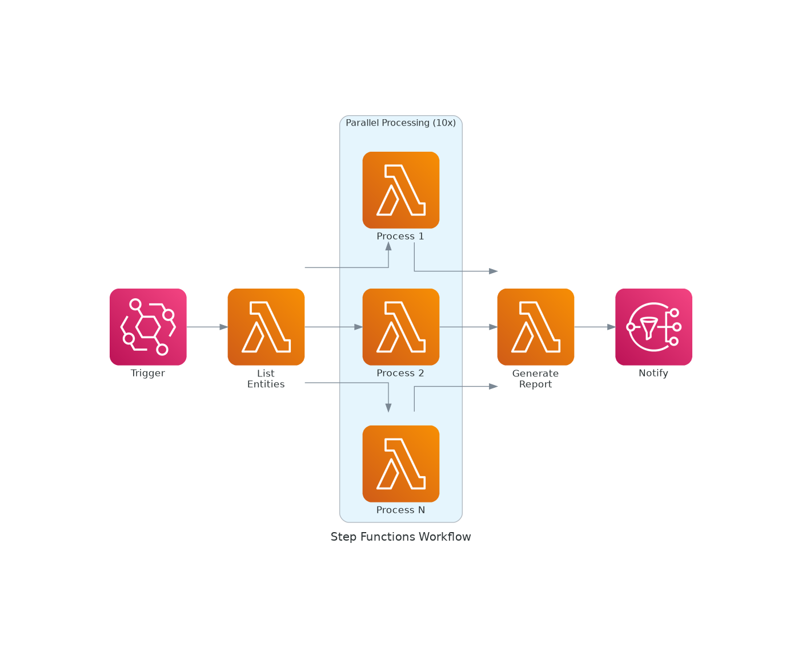

# Architecture

## Solution Overview

## Data Flow

## Step Functions Workflow

## Components

### Lambda Functions

| Function | Purpose | Memory | Timeout |
|----------|---------|--------|---------|
| ListEntities | Retrieve all IAM users and roles | 256 MB | 60s |
| ProcessEntity | Analyze usage via Access Advisor API | 512 MB | 300s |
| GenerateReport | Create summary report | 256 MB | 60s |

### Data Stores

| Service | Purpose | Retention |
|---------|---------|-----------|
| DynamoDB | Audit history per entity | 365 days TTL |
| S3 | JSON reports | Lifecycle policy |

### Security

- KMS CMK with auto-rotation for encryption at rest
- Least privilege IAM roles per Lambda
- S3 bucket policy enforces SSL + KMS
- DLQ with CloudWatch alarms

## Cost Model

| Scale | Monthly Cost |
|-------|--------------|
| 50 entities | ~$1.50 |
| 100 entities | ~$2.00 |
| 500 entities | ~$5.00 |
| 1,000 entities | ~$10.00 |

Primary cost drivers:
- Lambda duration (ProcessEntity)
- KMS CMK ($1/month fixed)
- CloudWatch Logs
